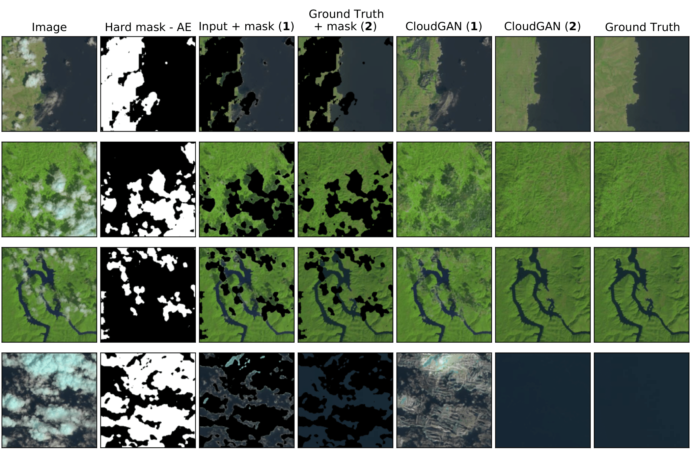

# CloudGAN: Detecting and Removing Clouds from RGB-images using Image Inpainting
  

This repository contains the code for the **CloudGAN**: a method to detect and inpaint clouds of satellite RGB-images. It consists out of two components:  cloud detection with an auto-encoder (AE) and cloud inpainting with the [SN-PatchGAN](https://arxiv.org/abs/1806.03589) ([GitHub](https://github.com/JiahuiYu/generative_inpainting)). Please note that a different license applies to the code for SN-PatchGAN (see the `cloud_removal` directory).  An overview of the method is given in the figure below.


Four examples of the CloudGAN input and output are also visualized here. The columns contain the following items:

- Column 1: RGB-image with the clouds. This serves as the input for CloudGAN.
- Column 2: The cloud mask generated by the AE (white = clouds, black = no clouds).
- Columns 3 and 5: The cloud mask subtracted from the input image (column 3). Highlighted with (**1**), and is used to generate the output in column 5. **This is the actual CloudGAN.**
- Columns 4 and 6: The cloud mask subtracted from the ground truth (column 4). Highlighted with (**2**). This set shows how the method would perform when the cloud mask would be perfect.
- Column 7: The ground truth.



There are significant differences between the output of CloudGAN (**1**) and CloudGAN (**2**). In short, this is due to the cloud edges and shadows not being detected by the AE and thus resulting in that the contextual attention from the SN-PatchGAN reuses those textures to fill in the gaps. For more details, please read the included paper.


## Contents

* [Overview of repository](#overview)
* [Requirements](#requirements)
* [Usage](#usage)
* [Datasets](#datasets)


## Overview of repository <div id="overview"></div>

Here, an overview is given of all included files. **Note that some scripts/code contain absolute/relative paths that might need to be updated for your personal machine. In case of the Bash-scripts, run them from the directory where they are saved, due to the relative paths.** The scripts should work if you store the datasets in a new directory called "datasets".

| Directory          | Description                                                  |
| ------------------ | ------------------------------------------------------------ |
| config             | `.yml`-files containing the configuration for the AE and SN-PatchGAN |
| cloud_detection    | Files containing the cloud detections methods (AE, [U-Net](https://arxiv.org/abs/1505.04597) and a naive approach) |
| cloud_removal      | Files in order to train and run the SN-PatchGAN on the cloud inpainting task |
| figures            | Figures for the README                                       |
| `CloudGAN.py`      | Python script to run the CloudGAN on your input image        |
| `paper.pdf`        | Paper describing the CloudGAN                                |
| `requirements.txt` | Python package dependencies                                  |


## Requirements <div id="requirements"></div>

The following requirements are needed in order to successfully run the CloudGAN code:

```
tensorflow-gpu==1.15
numpy==1.19.5
h5py==2.10.0
neuralgym @ git+https://github.com/JiahuiYu/neuralgym@88292adb524186693a32404c0cfdc790426ea441
scikit-image
tqdm
PyYAML
opencv-python
```

We used Python **v3.6.13**. For these packages holds that this exact version needs to be used. For all other dependencies holds that other versions might also work. A complete list is given in `requirements.txt`, but some may not be required.


## Usage <div id="usage"></div>

The weights that we obtained during training can be downloaded with the following links: [AE](https://drive.google.com/file/d/15HHF3ALyU1Cy7pDjs5yb5u-McyZTqYkS/view?usp=sharing), [U-Net](https://drive.google.com/file/d/1r6ya20ZwH6MO_RH0tlCwUbrwrnCvUsa3/view?usp=sharing) and [SN-PatchGAN](https://drive.google.com/file/d/1ibph7qO3y-Z5S-03x9GWTM3UhBae4Ow_/view?usp=sharing).


### Cloud detection: Naive, auto-encoder and U-Net

Two shellscripts (`ae.sh` and `unet.sh`) are provided which contain all the settings used in order to train three replications of each of the networks. To manually train a model, run the `main.py` script in the `cloud_detection` directory. Use the flag `--help` in order to get a summary of all the provided options. For the shellscripts, run them directly from the directory where they are saved, and make sure to save the datasets in a directory "datasets" (otherwise, change the paths in the scripts accordingly).

```shell
python3 main.py [options]
```

For the naive approach, the cloud-probabilities per HSV-component are computed beforehand and stored in the `.npy` files. If the files are missing, then it will recompute those probabilities and save them. Currently, the code is implemented such that it is evaluated over the whole test set of 38-Cloud. However, with some minor changes you can use it as your cloud detection method.


### Cloud inpainting: SN-PatchGAN

For the SN-PatchGAN, we would like you to refer you to their [GitHub](https://github.com/JiahuiYu/generative_inpainting) repository. Important to note is that we made some changes in their code, which unfortunately means that it is not possible to train a new instance with the SN-PatchGAN code in this repository.


### Cloud removal: CloudGAN

In order to run the complete method, use the provided `CloudGAN.py` script. With the following command, you can input your own satellite image (**must have a resolution of 256x256**):

```shell
python3 -m CloudGAN --img [path_to_input] --target [path_to_target]
                    --mask [path_to_mask] --output [path_to_output]
                    --weights_GAN [GAN_checkpoint] --config_GAN [.yml file]
                    --weights_AE [AE_checkpoint] --config_AE [.yml file]
```

In this example, the generated mask and output files are stored in their given paths. Additionally, it is possible to provide your own cloud mask. In this case, use the `--mask` option to provide the path to your mask (three channels, so 256x256x3, with values in [0,255]) and enable the `--no_AE` flag. The `--target` is optional, but if it is given then it computes the SSIM and PSNR values between the generated and target image. Lastly, there is the option to show more debug-messages from TensorFlow. To enable this add the `--debug` option to your command.

For the GAN-weights, link to the directory containing all files (i.e., the directory `SN_PatchGAN` that is downloaded with the provided link above). As for the AE-weights, link to the `checkpoint.h5` file.


## Datasets <div id="datasets"></div>

Two datasets are used in order to train the models: [38-Cloud](https://github.com/SorourMo/38-Cloud-A-Cloud-Segmentation-Dataset) for cloud detection and [RICE](https://github.com/BUPTLdy/RICE_DATASET) for the cloud removal part. However, since we have had to preprocess the datasets, we also provide our versions of these datasets below. If you want to know the specifics of the preprocessing, we refer you to the paper.

* Cloud detection (38-Cloud): [link](https://drive.google.com/file/d/1115zF8v_7PsX1qcKJbejtZV-MSCiyYLU/view?usp=sharing)
* Cloud removal (RICE): [link](https://drive.google.com/file/d/1_H26erCT3B8N-F75WvryMkvggPTTTYmM/view?usp=sharing)

We advise you to save the datasets in a new directory `datasets`, this way all default arguments and shellscripts should automatically work. Otherwise, you should set the relative paths accordingly.
